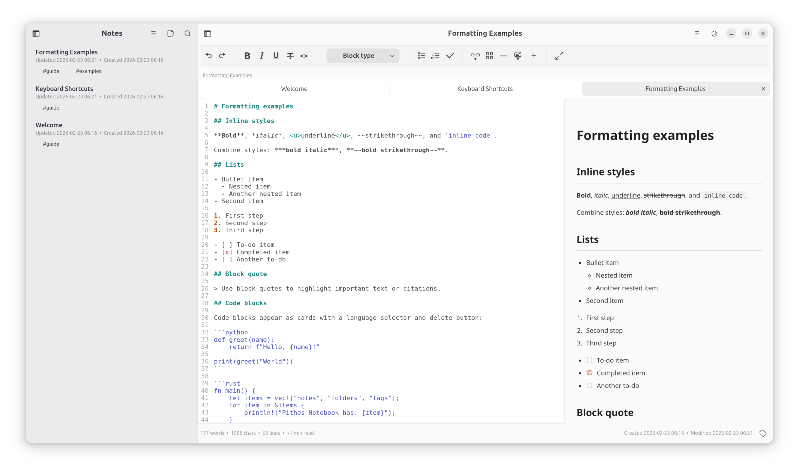
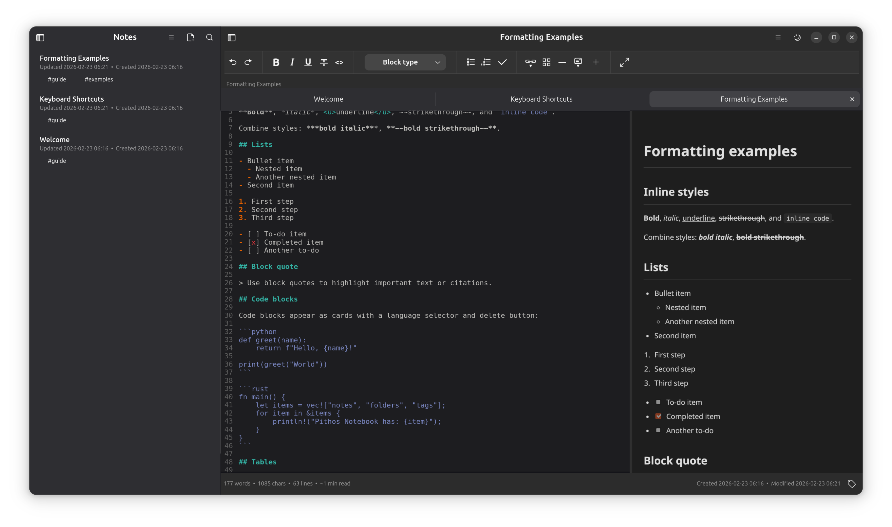
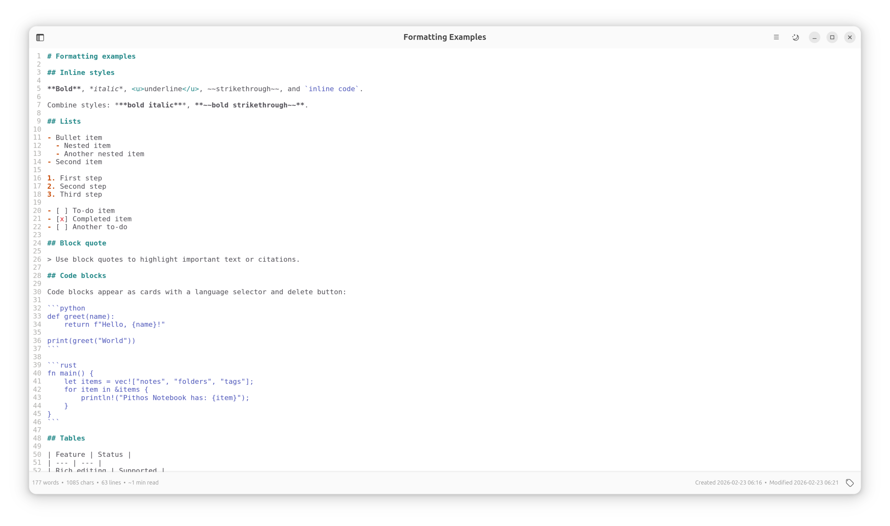
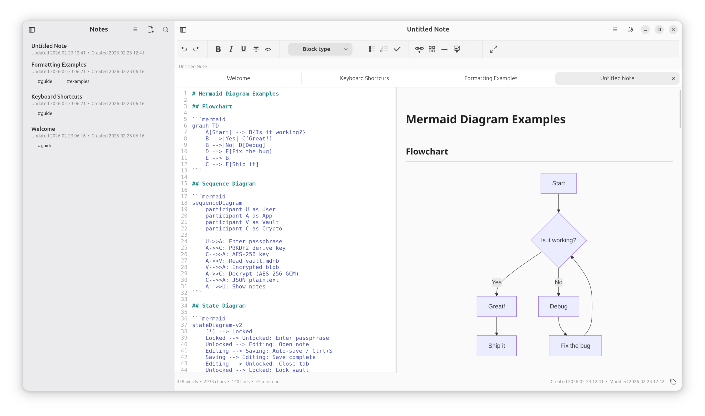

<p align="center">
  
</p>

<h1 align="center">Pithos Notebook</h1>

<p align="center">
  A private, encrypted markdown notebook for Linux.
  <br />
  Your notes never leave your machine.
</p>

<p align="center">
  <a href="https://snapcraft.io/pithos-notebook">
    
  </a>
</p>

---

Most note-taking apps sync your data to someone else's server. Pithos Notebook doesn't. Write in Markdown, organise your notes, and keep everything encrypted on your device — no accounts, no cloud, no telemetry.

## Who It's For

Anyone who writes in Markdown and doesn't want their notes on someone else's server. Developers, writers, researchers, students, consultants — if you've ever felt uncomfortable with your notes living in Notion or Evernote, Pithos Notebook is for you.

Trusted by security professionals, enterprise architects, and consultants for sensitive technical documentation — threat models, architecture decision records, and client meeting notes. If your work involves information that genuinely cannot leave your machine, Pithos Notebook was built with you in mind.

## Screenshots

| Light Mode | Dark Mode |
|:---:|:---:|
|  |  |

| Zen Mode | Mermaid Diagrams |
|:---:|:---:|
|  |  |

---

## Features

### Encrypted Vault

- Everything you write is encrypted on your device with a passphrase you choose. No passphrase, no access — not even for you.
- Your vault is backed up automatically before every save.
- Change your passphrase at any time — the entire vault is re-encrypted in a single atomic operation.
- Zero outbound connections. No telemetry, no analytics, no cloud sync.

### Writing

- Write in Markdown with a syntax-highlighted editor and a live side-by-side preview.
- Draw architecture diagrams, flowcharts, and sequence diagrams using Mermaid blocks — rendered live in the preview.
- Code blocks with syntax highlighting for YAML, HCL, JSON, PowerShell, KQL, Bash, Python, SQL, Rust, Go, JavaScript, TypeScript, Dockerfile, HTML, CSS, C, C++, and Java.
- Markdown tables with toolbar support — add rows, add columns, auto-align.
- Find and replace with optional regex.
- Distraction-free writing with Zen mode.

### Organisation

- Organise notes in nested folders with drag-and-drop.
- Open multiple notes in tabs, drag to reorder.
- Tag notes and filter by multiple tags.
- Search across note titles and content.
- Create a Daily Note with a single shortcut.
- Start new notes from built-in templates: Threat Model, Architecture Decision Record, IAM Blueprint, Runbook, Meeting Notes, and Security Review.
- Deleted notes go to Trash and are recovered any time within 30 days.
- Save named snapshots of any note and restore earlier versions.

### Desktop Integration

- Built natively with GTK 4 and Libadwaita — feels at home on GNOME.
- Follows your system's light or dark mode, or toggle manually.
- Sidebar collapses automatically on narrow windows.
- Auto-saves every 30 seconds and when you close the app.
- Import any .md file. Export notes as Markdown, HTML, PDF, Word, LaTeX, or EPUB.
- Switch between multiple vaults without restarting the app.
- Full keyboard shortcut coverage and a command palette for every action.

---

## Security

For those who want the technical details:

| | |
|---|---|
| **Encryption** | AES-256-GCM with PBKDF2-SHA256 (600k iterations); fresh salt per session |
| **Storage** | Passphrase never stored; vault unlocked once per session |
| **Assets** | Images encrypted individually alongside the vault |
| **Preview** | WebView runs with nonce-based CSP, ephemeral session, navigation blocked, script tags stripped |
| **Key material** | `ZeroizeOnDrop` on cached keys; plaintext vault JSON zeroized after encryption |
| **File I/O** | Atomic writes (write-to-tmp-then-rename); path traversal prevention on asset IDs |
| **Passphrase change** | Transactional all-or-nothing re-encryption of vault and all assets |
| **Network** | Zero outbound connections |
| **Telemetry** | None. No analytics, no tracking, no cloud sync |

> **Snap sandbox note:** The snap package disables WebKit's internal bubblewrap sandbox (`WEBKIT_DISABLE_SANDBOX_THIS_IS_DANGEROUS`) because snap's strict confinement seccomp filters block the nested bwrap calls WebKit requires. Snap's own strict confinement still sandboxes the entire application. When running from source outside the snap, WebKit retains its full internal sandbox.

---

## Install

### Snap (recommended)

```bash
sudo snap install pithos-notebook
```

Pandoc and Typst are bundled inside the snap — PDF, Word, LaTeX, and EPUB export work out of the box.

### Deb

Download the `.deb` from the [Releases](https://github.com/iamcarrasco/Pithos-Notebook/releases) page:

```bash
sudo apt install ./pithos-gtk_0.2.5-1_amd64.deb
```

The deb installs `pandoc` automatically via its dependency list. For PDF export you also need [Typst](https://github.com/typst/typst/releases) on your `PATH`.

### Build from source

```bash
# Install build dependencies (Ubuntu/Debian)
sudo apt install pkg-config libgtk-4-dev libadwaita-1-dev \
  libgtksourceview-5-dev libwebkitgtk-6.0-dev libjavascriptcoregtk-6.0-dev

cargo build --release -p pithos-gtk
# Binary at target/release/pithos-notebook
```

For export support, install `pandoc` and optionally [Typst](https://github.com/typst/typst/releases) for PDF.

---

[Changelog](CHANGELOG.md) · [GPL-3.0](LICENSE)
